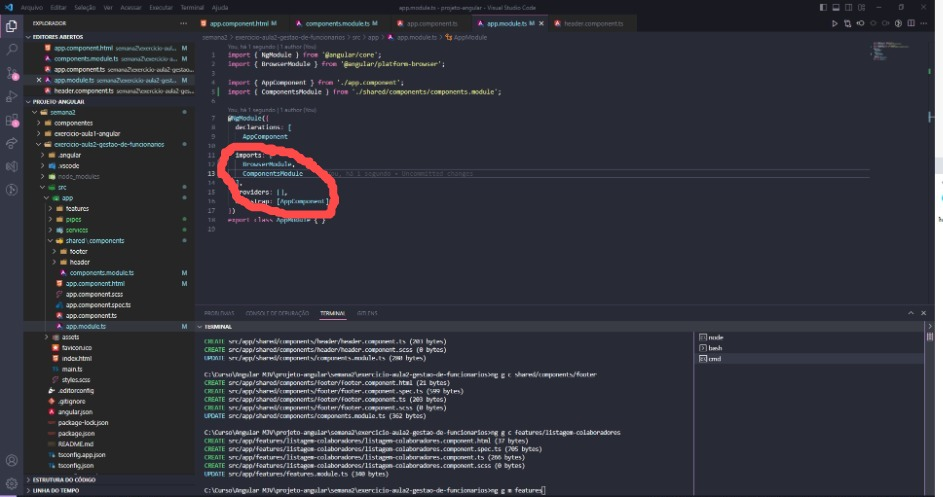

# Exercícios:
### OBS:. O exercício da semana 1 está em outro repositório

<h3>Componente | Exercício | Semana 2 | Angular | aula 1</h3>

<a href="https://www.loom.com/share/7424eba99bc041d7a41463d654ddb200" 
text-decoration="none">Clique aqui para ver o vídeo</a> 
<a href="https://github.com/bruleonel/projeto-angular/commit/0b260832
8e2a58c94df65fdaec81ade59fd597a8" text-decoration="none">Clique aqui 
para ver o código</a>

<h3>Módulos | Exercício | Semana 2 | Angular | aula 2</h3>

<a href="https://www.loom.com/share/e585ee631e334b4f9ebffba395f35570" 
text-decoration="none">Clique aqui para ver o vídeo</a> 
<a href="https://github.com/bruleonel/projeto-angular/tree/main/
semana2/exercicio-aula2-gestao-de-funcionarios" text-decoration=
"none">Clique aqui para ver o código</a>

<h3>Typescript | Exercício | Semana 2</h3>

<a href="https://github.com/bruleonel/projeto-angular/tree/main/semana2
/typescript" text-decoration="none">Clique aqui para ver o código</a>

Aqui eu pensei em criar uma tabela, porém não quis extrapolar o que foi 
solicitado.

<h3>Exercício | Semana 3</h3>

  

<a href="https://github.com/bruleonel/projeto-angular/tree/main/
semana2/exercicio-aula2-gestao-de-funcionarios" text-decoration=
"none">Clique aqui para ver o código</a>

<h3>Exercício | Semana 4</h3>

  

<a href="https://github.com/bruleonel/projeto-angular/tree/main/
semana2/exercicio-aula2-gestao-de-funcionarios" text-decoration=
"none">Clique aqui para ver o código</a>

# Projeto Angular

Este projeto foi criado para acompanhamento do curso de Angular com a 
empresa MJV. Aqui deixarei registrado anotações importantantes e 
também meus exercícios separados por semana.

## Semana 2
## Observações:
Ao criar o projeto angular ele vem com as configurações padrão, você 
pode criar componetes (pastas) para "montar" sua aplicação, como
por exemplo: Header.

Esse compenete poder ser compartilhado com outros componentes para 
facilidar no desenvolvimento. Não esquça de passar a rota dos 
componentes criados 
que fica no documento TS pra o app.component.html que será o responsável
 por carregar o projeto.
### Para baixar o Agular Cli usei:
- npm intall -g @angular/cli

### Erro: 'ng' não é reconhecido como um comando interno ou externo, um 
programa operável ou um arquivo em lotes.

Resolvi esse problema excluindo o nodeJs e instalando novamente. Após 
isso desintalei o angular e limpei o cache com os comandos:

npm uninstall -g angular-cli
npm uninstall --save-dev angular-cli
npm cache clean

Depois reinicei o pc e instalei o angular cli novamente:
npm install -g @angular/cli

### Para criar um projeto:
- ng new <nome>

### Para instalar dependencias quando você da um fork:
- nmp install

## Módulos

### O que são?
Os Modules gerenciam os components e é com eles que nós podemos modularizar
nossa aplicação. Resumindo, bem a grosso modo: É como se o Module fosse 
um cômodo e os Components os móveis que preenchem aquele cômodo.
Com os módulos você cria seções para a mesma aplicação. 

### Comando: 
- ng generate module <nome>

### Quando criar o módulo não esqueça de importar:
Dentro da pasta app.modules.ts >

Exemplo:

  

### E não esqueça de exportar:
Dentro da pasta <nome>  modules.ts >

  

## Pra finalizar:
Vá dentro dos componetes exportados e copie a rota no arquivo TS pra colar
 no app.componet.html

Exemplo de rota: <app-header></app-header>

## Interpolação
Para fazer interpolação de TypeScript com HTML:
- Crie as variáveis dentro do arquivo TS, depois coloque detro das tags 
no arquivo HTML

Exemplo:

  

## Para rodar o projeto:
- ng serve -o

## Para criar um component:
- ng g component <nome>

